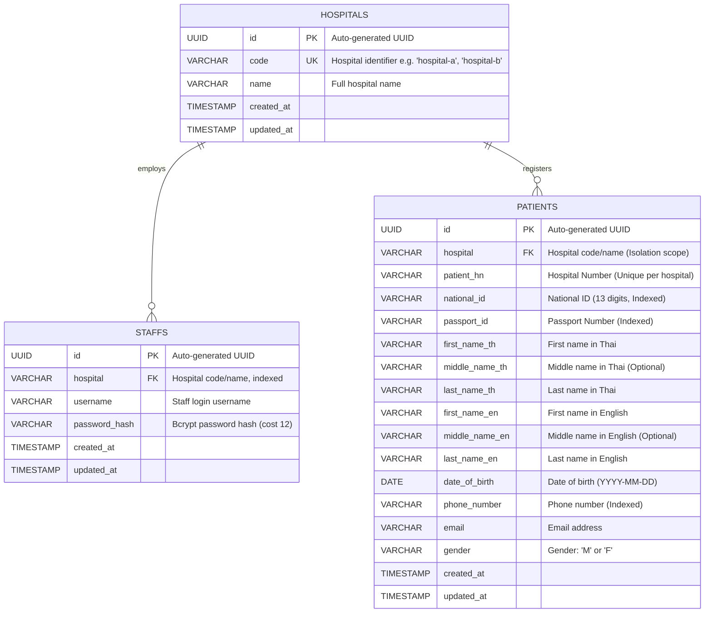

# Database Schema & ER Diagram

This document describes the Database Schema and Entity-Relationship Diagram for the **Hospital Middleware System**, fulfilling **Deliverable 1.c** of the Agnos Candidate Assignment.

---

## 1. Entity-Relationship Diagram (Mermaid)



---

## 2. Model Specifications

### 2.1 Hospital Model
* **Purpose:** Multi-tenant organization entity.
* **Fields:**
  * `id`: UUID (Primary Key).
  * `code`: String, Unique (e.g., `hospital-a`).
  * `name`: String (e.g., `Hospital A Medical Center`).
  * `created_at`, `updated_at`: Timestamps.

### 2.2 Staff Model
* **Purpose:** Hospital personnel authorized to access the system.
* **Fields:**
  * `id`: UUID (Primary Key).
  * `hospital`: String (Hospital Identifier).
  * `username`: String (Login identifier).
  * `password_hash`: String (Hashed using Bcrypt with salt).
  * `created_at`, `updated_at`: Timestamps.
* **Security & Constraints:**
  * Composite Unique Index on `(hospital, username)`: prevents duplicate usernames within the same hospital.
  * Passwords are never stored in plaintext.

### 2.3 Patient Model
* **Purpose:** Stores patient demographic and identification records synchronized from HIS.
* **Fields (Directly compatible with Hospital A HIS API response):**
  * `id`: UUID (Primary Key).
  * `hospital`: String (Hospital identifier enforcing data isolation).
  * `patient_hn`: String (Hospital Number).
  * `national_id`: String, Nullable (Citizen ID).
  * `passport_id`: String, Nullable (Passport ID).
  * `first_name_th`, `middle_name_th`, `last_name_th`: String.
  * `first_name_en`, `middle_name_en`, `last_name_en`: String.
  * `date_of_birth`: Date (`YYYY-MM-DD`).
  * `phone_number`: String, Nullable.
  * `email`: String, Nullable.
  * `gender`: String (`M` or `F`).
  * `created_at`, `updated_at`: Timestamps.
* **Constraints & Indexes:**
  * Unique Composite Constraint: `(hospital, patient_hn)`.
  * Index on `(hospital)` for mandatory tenant isolation.
  * Compound Indexes on `(hospital, national_id)`, `(hospital, passport_id)`, `(hospital, phone_number)` for high-performance dynamic queries.

---

## 3. Data Isolation Design (Key Assessment Requirement)
> **Requirement 3 & 4:** *"each staff can only search for patient in the same hospital as the staff"*

Every patient record in the database has a mandatory `hospital` attribute. When a staff member executes `/patient/search`, the middleware extracts the staff's `hospital` from the verified JWT claims and enforces:
```sql
SELECT * FROM patients WHERE hospital = :staff_hospital AND (filter_conditions...);
```
Under no circumstances can a staff member query or retrieve records belonging to another hospital.
